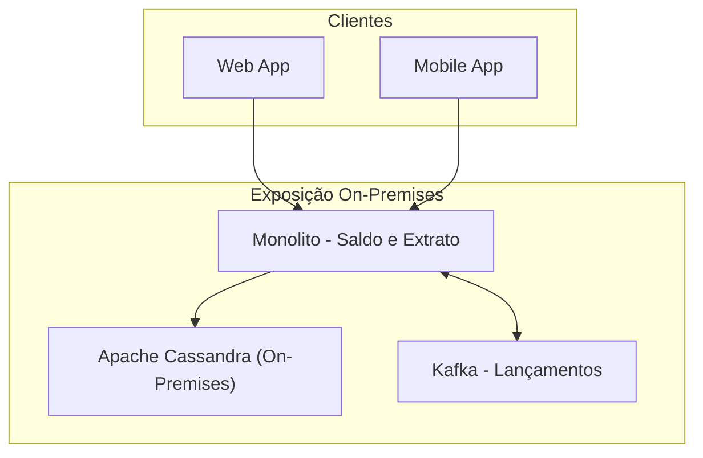
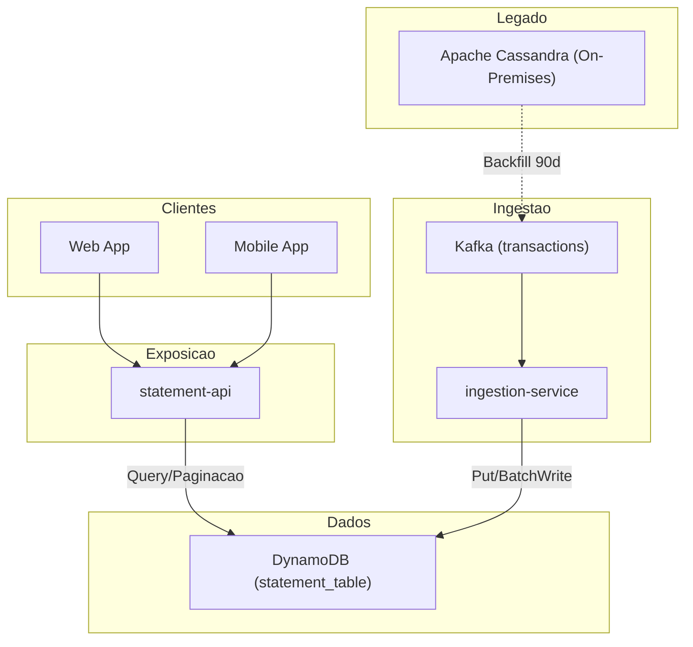

# Segregação da Exposição e Ingestão do Extrato

## Contexto
O monólito atual concentra **saldo** e **extrato**. A rota de extrato sofre com alto acoplamento a cálculos de saldo e janelas de deploy que derrubam o serviço.

**Baseline (últimos 14 dias, 2025-01-06..2025-08-20; fonte: Grafana/Prometheus):**
- `GET /statement?days=90` p95 = **3,4 s** (web/mobile, sa-east-1)
- Disponibilidade mensal = **90,0%**
- Durante deploys, o sistema fica **indisponível** (janelas médias de 15–20 min)
- Banco de dados: **Apache Cassandra On-Premises** com contenção em leitura e compactions em horários de pico

**Restrições e assunções:**
- **Sem breaking change** no contrato público do extrato
- Primeiro passo **somente listagem do extrato** (saldo permanece no monólito neste ciclo)
- Preservar trilha de auditoria; migração histórica via backfill

## Objetivo (SMART)
Até **2025-12-30**, para `GET /statement?days=90`:
- Reduzir **p95 ≤ 800 ms** e **p99 ≤ 1500 ms**
- Atingir **disponibilidade ≥ 99,5%** (janela mensal; error budget 0,5%)
- Garantir **zero-downtime deployments** (pico de 5xx ≤ 0,2% durante rollout)
- Medir em janelas simétricas de **14 dias** (pré/pós), fontes: Grafana/Prometheus/APM

## Decisão
**Rearquitetar por segregação de fluxos**:
1. **Ingestão**: microserviço `ingestion-service` consome eventos financeiros do **Kafka** e **persiste no DynamoDB** (modelo orientado a conta + data).
2. **Exposição**: microserviço `statement-api` **consulta e pagina** diretamente no **DynamoDB**, realizando **agregações por intervalo** (por dia/mês) quando necessário.
3. **Desacoplamento de saldo**: extrato não recalcula saldo transacional; exibe linhas + subtotais; saldo consolidado fica a cargo do monólito nesta fase.

## Alternativas Consideradas
- **Permanecer no Cassandra On-Prem (tuning + MVs)**  
  *Prós*: evita nova stack; *Contras*: custos operacionais altos, risco de compactions, dificuldade de zero-downtime e de escalar leitura por partição; rejeitado.
- **Materializar extrato em Elasticsearch**  
  *Prós*: consultas e paginação rápidas; *Contras*: pipeline e custo de reindexação, consistência eventual mais complexa, duplicação de storage; rejeitado neste passo.
- **PostgreSQL gerenciado (RDS) com índices por conta/data**  
  *Prós*: simplicidade de query; *Contras*: write amplification e hot partitions sob alto throughput de eventos; risco de bloqueios em picos; rejeitado.

## Consequências
**Positivas:** leitura previsível (PK=conta, SK=data), escalabilidade horizontal, deploys independentes, redução de acoplamento com saldo.  
**Negativas:** nova superfície operacional (Kafka/DynamoDB), **consistência eventual** entre ingestão e exposição, necessidade de **idempotência** por evento.

## Métricas de Sucesso e Observabilidade
- **SLIs**: p95/p99 da rota `/statement`, taxa de 5xx, disponibilidade (SLO 99,5%), tempo de deploy com erro ≤ 0,2%  
- **Pipeline**: *consumer lag* (Kafka), **Consumed/Provisioned Capacity** (DynamoDB), taxa de throttling, latência de Query/Scan  
- **Custo**: estimativa mensal DynamoDB (RCU/WCU), tráfego, armazenamento  
- **Alertas**: p95 > alvo por 5 min; throttling > 3%; *lag* > 60s;

## Resultados — STAR 
- **S** (Situação): monólito com p95 **3,4 s**, disponibilidade **90%**, **downtime** nos deploys, Cassandra On-Prem com compactions em pico.  
- **T** (Task): até **2025-09-30**, p95 ≤ **800 ms**, p99 ≤ **1500 ms**, **≥ 99,5%** de disponibilidade, **zero-downtime deploy**
- **A** (Action): segregação ingestão/exposição; Kafka → DynamoDB (idempotência); `statement-api` paginado; backfill de 90d; rollout canário com abort thresholds; validação por amostra.  
- **R** (Result, pós 14 dias do 100% rollout):  
  - p95 = **780 ms** (↓ **2,62 s** / **−77%**), p99 = **1,42 s**  
  - Disponibilidade = **99,72%** (error budget consumido: 0,28%)  
  - 5xx = **0,58%**; **zero-downtime** observado em 3 deploys  
  - **T+30** agendado para checar sustentabilidade e ajustar RCU/WCU

