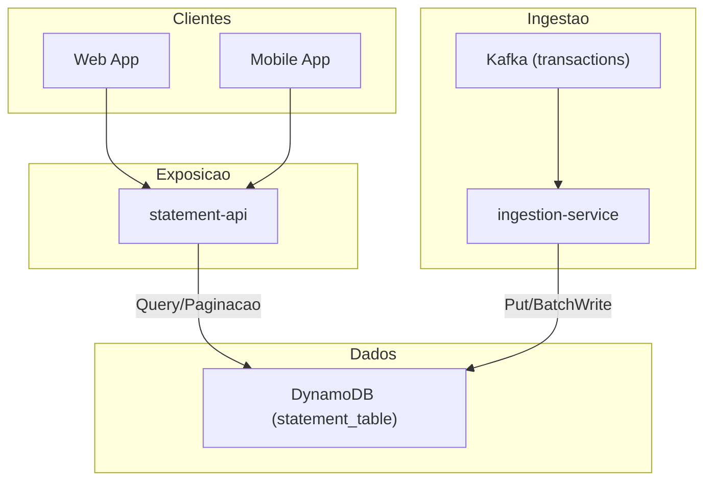
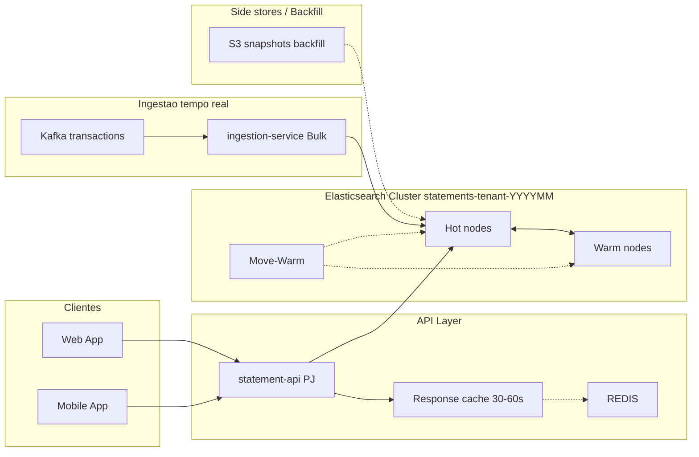
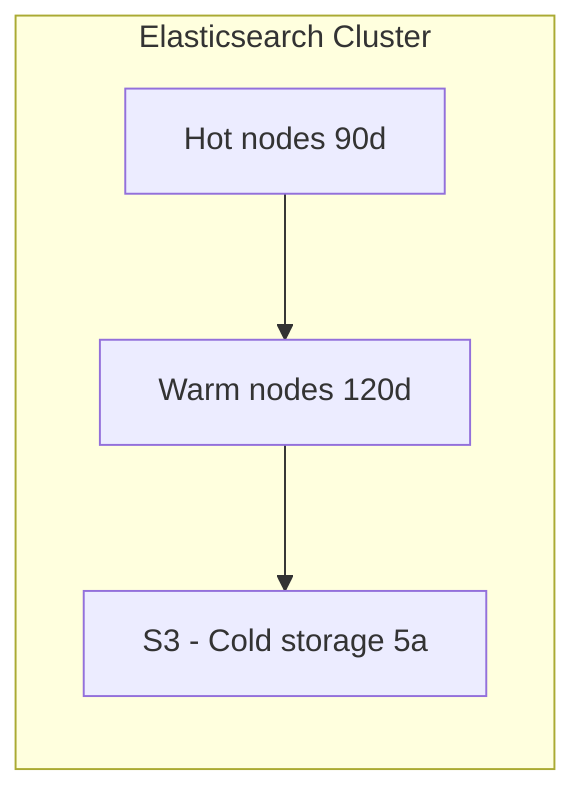

# Extrato PJ com agregações e busca textual — migração para Elasticsearch como base principal

## Contexto
Após a extração do extrato para microserviços, **clientes PJ** solicitaram consultas analíticas e busca textual:
- “Tudo que **recebi via Pix** no período X”
- “Tudo que **recebi com a descrição ‘XXXX’**”
- “Soma por forma de pagamento / centro de custo / tag”

O **DynamoDB** (atual operacional do extrato) mostrou limitações para esses casos:
- **Agregações** exigem _fan-out_ de queries por partição + _merge_ em aplicação → **latência alta** em janelas amplas.
- **Full-Text Search** na `description` **inexistente** (match parcial/linguístico pobre).
- **Throttling** recorrente de **RCU/WCU** sob picos de ingestão e consultas amplas; **backoffs** perceptíveis.
- **Custo**: crescimento desproporcional ao volume de leitura/agrupamentos PJ.




**Baseline (últimos 14 dias; dados fictícios para ilustração):**
- `GET /statement?range=90d` (PJ, com filtros e agregações em app): **p95 = 2.1 s**, **p99 = 4.6 s**
- Consultas “Pix recebidos” (90d): **p95 = 1.9 s**, variação alta por _fan-out_
- Busca por descrição (substring): **não suportada**; _workaround_ com `begins_with` ineficaz
- **Throttling** médio: **RCU 3–5%**, **WCU 1–2%** nas janelas de pico


## Objetivo (SMART)
Até **2025-09-30**, para **consultas PJ**:
- **Agregações** (ex.: sum por `method=PIX` em 90d): **p95 ≤ 700 ms**, **p99 ≤ 1.5 s**
- **Full-Text Search** em `description`: **p95 ≤ 900 ms** com ordenação por tempo
- **Throttling** operacional: **0%** na camada de leitura/ingestão (com _backpressure_ controlado)
- **Custo**: **reduzir em ≥ 30%** o custo mensal das leituras PJ vs baseline
- **SLO disponibilidade** (statement-api): **≥ 99,5%**
- Medição em janelas simétricas de **14 dias** (pré/pós), fontes: APM/Grafana + logs de busca

## Decisão
Adotar **Elasticsearch** (compatível com OpenSearch) como **base principal** de consulta do extrato **para PJ e PF**, cobrindo:
- **Agregações nativas** (terms, date_histogram, sum) e **Full-Text Search** (analisadores PT-BR, _match phrase_, _prefix_ controlado)
- **Modelagem** e **roteamento** para localidade por conta/tenant, com **paginação via PIT + `search_after`**
- **Ingestão otimizada** via **Bulk API** a partir do Kafka, com **pipelines de ingestão** (normalização/flatten) e **ILM** (hot→warm)



### Rollover de Dados



### Alternativas Consideradas
- **Manter DynamoDB + DAX + pré-agregações por job**  
  _Prós_: Reuso, baixa mudança de stack. _Contras_: Complexidade/atraso para _rollups_, ausência de listagem, custo ainda atrelado a _fan-out_; rejeitado.
- **Athena/Presto sobre S3 (batch)**  
  _Prós_: Excelente para relatórios amplos. _Contras_: Não atende _latência on-line_ (p95 sub-segundo) da API; rejeitado para _read path_.
- **PostgreSQL com índices GIN/BRIN**  
  _Prós_: listagem e agregações maduras. _Contras_: _write amplification_ e contenda sob ingestão alta; custo de _scale-up_; rejeitado neste contexto.

## Consequências
**Positivas**
- Queries PJ com **agregações** e **Listagem** nativas; **latência menor** e **previsível**
- **Redução de custo de leitura** (cluster provisionado; caching/roteamento)
- **Eliminação de throttling** visível no _read path_

## Modelo de Dados (Elasticsearch)

```json
{
  "mappings": {
    "_routing": { "required": true },
    "properties": {
      "tenantId":    { "type": "keyword" },
      "accountId":   { "type": "keyword" },
      "eventAt":     { "type": "date", "format": "strict_date_optional_time||epoch_millis" },
      "amountCents": { "type": "long" },
      "direction":   { "type": "keyword" },            // ex.: debit, credit
      "method":      { "type": "keyword" },            // ex.: PIX, TED, BOLETO, CARTAO
      "description": {
        "type": "text",
        "analyzer": "pt_brazilian"
      },
      "description_raw": {
        "type": "keyword",
        "normalizer": "folding"
      },
      "tags":        { "type": "keyword" }
    }
  },
  "settings": {
    "refresh_interval": "5s",
    "analysis": {
      "analyzer": {
        "pt_brazilian": { "type": "brazilian" }
      },
      "normalizer": {
        "folding": {
          "type": "custom",
          "filter": ["lowercase", "asciifolding"]
        }
      }
    }
  }
}

```

## Ingestão (Performance)
- **Fonte**: Kafka `transactions` (mesmo tópico atual)  
- **Consumer** com **BulkProcessor** (tamanho ~5–15 MB ou 2–5k docs; _flush_ por tempo)  
- **_Idempotency_**: `_id = accountId#eventId` para evitar duplicatas  
- **`refresh_interval` = 5s** (hot) para reduzir custo de indexação; usar **_forced refresh_** apenas quando necessário  
- **Backpressure**: pausar consumo se _queue_ do Bulk crescer; _retry_ exponencial com `429` / `503`

## Leitura (Performance)
- **Roteamento** (`routing = accountId`) → concentra leitura em **1 shard**  
- **Paginação** via **PIT + `search_after`** (estável; evita `from/size` altos)  
- **Caches**: _query cache_ e _request cache_ habilitados para agregações comuns; TTL de respostas curtas em API (ex.: 30–60s)  
- **Agregações PJ típicas**:  
  - `method=PIX AND direction=credit` + `date_histogram` (diário) + `sum(amountCents)`  
  - `description: "XXXX"` com filtro por período e `sum`/`count`

## Métricas de Sucesso e Observabilidade
- **SLIs**: p95/p99 (agregações), taxa de 5xx, erro de _timeout_  
- **Ingestão**: _bulk reject rate_, _latência_ do bulk, _consumer lag_ Kafka  
- **Cluster**: CPU, heap, GC, _segment count_, _indexing pressure_, _queue size_  
- **Custo**: $/mês cluster vs custo de RCU/RCU suprimidos  
- **Qualidade**: divergência monetária (amostra) ≤ **R$ 0,01**


## Resultados — STAR 
- **S**: p95 agregações = **2.1 s**; throttling RCU/WCU em picos (3–5%); custo elevado com _fan-out_.  
- **T**: p95 agregações ≤ **700 ms**; listagem p95 ≤ **900 ms**; **0% throttling**; **−30% custo**; SLO ≥ **99,5%**.  
- **A**: Elasticsearch como base principal; modelagem por tenant/mês + routing por `accountId`; ILM; Bulk ingest com `_id` determinístico; PIT + `search_after`; caches; novas rotas `/search` e `/aggregate`.  
- **R (pós 14 dias de 100% rollout)**:  
  - Agregações PJ (90d): **p95 = 640 ms** (↓ **1.46 s**, −69%); **p99 = 1.2 s**  
  - Listagem `description`: **p95 = 780 ms** (janela comparável)  
  - **0%** throttling percebido; **5xx = 0.55%**  
  - **Custo −33%** vs baseline de leitura PJ  
  - _Follow-up_ **T+30** para revisar mapeamentos e _warm tiers_