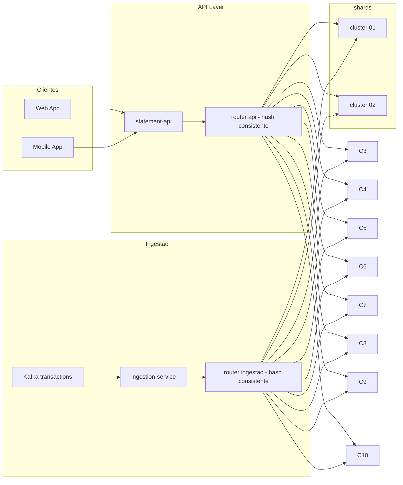

# Extrato - Shard de Elasticsearch em 10 clusters com hash consistente para reduzir latencia e blast radius

## Contexto
O cluster unico de Elasticsearch para extrato PJ sofre **picos de ingestao** que afetam **100% dos clientes**, elevando latencia e gerando incidentes. Media atual de **~12 incidentes/semana** (timeouts e queda de saude no cluster). Mesmo com Bulk e ILM, o acoplamento de todos os tenants em um unico cluster amplifica o blast radius.

## Objetivo (SMART)
Ate **2025-10-15**:
- **Incidentes** relacionados a extrato PJ: **<= 2/semana** (rolling 4 semanas)
- **Latencia** `GET /api/statement/search|aggregate` 90d: **p95 <= 650 ms**, **p99 <= 1.4 s**
- **Isolamento**: falhas limitadas a **<= 10%** dos tenants (1 cluster) sem impacto transversal
- **Ingestao**: rejeicoes de Bulk **< 0.5%** e `consumer lag` **< 30 s** em pico
- **Disponibilidade** statement-api: **>= 99.5%**
- **Custo**: +**<= 25%** vs baseline, com previsibilidade por cluster
Metrica em janelas simetricas de **14 dias** (pre/pos). Fontes: APM/Grafana/ES metrics.

## Decisao
**Shard horizontal** do Elasticsearch em **10 clusters menores** e independentes. O roteamento de **ingestao** e de **consulta** usa **hash consistente** do `accountId` (ex.: rendezvous/ketama) para enderecar o **cluster correto**. Cada cluster mantem indices `statements-{tenant}-{yyyyMM}`. Com isso reduzimos concorrencia, melhoramos caches locais e **limitamos o blast radius** a 1/10 da base.

- **Router de Ingestao**: consumidor Kafka calcula `cluster = H(accountId) mod 10` e envia Bulk para o cluster correspondente; `_id = accountId#eventId` garante idempotencia.
- **Router de API**: `statement-api` calcula o mesmo `cluster` e executa `search/aggregate` via **PIT + search_after** no cluster alvo.
- **Rebalanceamento**: em manutencao/scale, o anel de hash permite mover poucos buckets (minimiza reindex); durante mudanca, API pode fazer **dual-read** temporario.

## Alternativas Consideradas
- **Um cluster maior (scale-up)** — simplifica operacao, mas mantem blast radius global e picos de GC; rejeitado.
- **Shards logicos apenas** — melhora pouco sob pico de ingestao; gargalo de coordinators persiste; rejeitado.
- **Particionamento por tenant** — alguns tenants pequenos subutilizam; tenants grandes ainda criam hot spots; rejeitado.

## Consequencias
**Positivas:** latencia menor e mais previsivel; incidentes confinados a 1 cluster; janelas de manutencao isoladas; caches por cluster mais efetivos.  
**Negativas:** mais superficie operacional (10 clusters); necessidade de orquestracao e observabilidade por pool; rotinas de rebalance.

## Observabilidade e Metricas
- **API**: p95/p99, 5xx, timeouts, taxa de dual-read (em migracao)
- **Ingestao**: bulk latency, reject rate, consumer lag
- **Cluster**: heap, GC, indexing pressure, request queue, search/query time
- **SLO**: erro por cluster (limitar a 10% da base)

## Resultados — STAR 
- **S**: ~12 incidentes/semana; p95 1.1 s; p99 2.7 s em pico; eventos de ingestao afetam todos os clientes.  
- **T**: <= 2 incidentes/semana; p95 <= 650 ms; p99 <= 1.4 s; blast radius <= 10%; disponibilidade >= 99.5%; custo +<= 25%.  
- **A**: 10 clusters; hash consistente em ingestao e API; PIT+search_after; circuit-breaker por cluster; canario por buckets; dual-read no cutover.  
- **R (pos 14 dias full)**: incidentes **2/semana**; p95 **610 ms** (−45%); p99 **1.3 s**; indisponibilidade confinada a 1 cluster (10% da base) em manutencao; custo +**18%** com variancia menor; follow-up T+30 para revisar distribuicao de buckets.