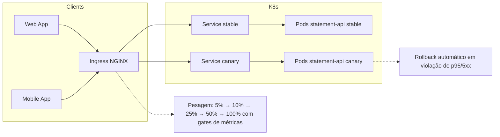

# Extrato - "Canary release com Argo Rollouts + ArgoCD para reduzir incidentes de deploy"

## Contexto
Apesar da divisão de dados e do sharding em 10 clusters ES, os **deploys “all-in-one”** das aplicações (`statement-api` e `ingestion-service`) ainda **impactam 100% do tráfego** no momento do rollout, gerando **picos de erro/latência** e contribuindo para ~**6 incidentes/semana**. As réplicas são trocadas de uma vez (rolling padrão), sem **gates de métricas**, testes sintéticos ou **pausas** para análise.

## Objetivo (SMART)
Até **2025-10-01**:
- **Reduzir incidentes de deploy** de ~6/semana para **≤ 2/semana** 
- **Conter blast radius de deploy** a **≤ 10%** do tráfego durante validação canário.
- **Garantir SLO durante rollout**: `p95` da rota `/pj/statement/search` **≤ +10%** do baseline e **5xx ≤ 0,8%** em cada etapa.
- **Deploys com auto-rollback** em **< 5 min** após violação de métrica.
- Cobrir **statement-api** (read path) e **ingestion-service** (write path) com estratégias adequadas.

Medição em janelas simétricas de 14 dias (pré/pós). Fontes: Prometheus/Grafana, logs, checks sintéticos.

## Decisão
Adotar **Argo Rollouts** para **canary release** com **gates de métricas** (Prometheus) e **ArgoCD** para GitOps e orquestração:
- **statement-api (read path)**: canário com **tráfego progressivo** (5%→10%→25%→50%→100%), **pausas** e **Analysis** automatizada em cada etapa.
- **ingestion-service (write path)**: **canário por partição** (ex.: buckets de hash 1/10) com **shadow write** opcional e validações de **bulk reject/lag** antes de aumentar escopo.

## Alternativas Consideradas
- **RollingUpdate padrão do Deployment** — simples, porém sem controle de tráfego e sem análises automáticas; rejeitado.
- **Blue/Green** — reduz tempo de troca, mas ainda com cutover binário e risco de blast radius; útil em casos específicos, mas não resolve análise progressiva; rejeitado como padrão.
- **Feature flags somente** — ajudam na lógica, mas não resolvem roteamento/telemetria de rollout; complementar, não substituto.

## Consequências
**Positivas:** menor impacto por etapa; rollback rápido; evidências por etapa; padronização de deploy confiável.  
**Negativas:** mais objetos de K8s (Rollout/AnalysisTemplate); dependência de métricas íntegras; pequena complexidade operacional inicial.

## Plano de Implementação e Rollout
1. **ArgoCD**: habilitar `automated sync` com **waves** (AnalysisTemplate/CM primeiro; depois Rollout/Services/Ingress).  
2. **Tráfego**: usar **NGINX Ingress** (ou ALB/SMI) para `trafficRouting` do Rollout.  
3. **Métricas**: expor **p95**, **error_rate**, **TTFB** e **checks sintéticos** no Prometheus por `version`.  
4. **statement-api**: canário 5/10/25/50/100 com **pausas** de 2–5 min e **AnalysisRun** por etapa.  
5. **ingestion-service**: canário por **buckets de hash** (1/10 a cada passo); validar **bulk_reject_rate**, **consumer_lag** e **indexing_pressure** no ES do bucket afetado.  
6. **Fallback**: rollback automático + **freeze** de deploys se 2 falhas consecutivas ocorrerem.  
7. **Runbooks** e **dashboards** dedicados por versão.
8. 
## Métricas & Gates (Prometheus – exemplos)
- `rate(http_requests_total{app="statement-api",status=~"5..",version="$CANDIDATE"}[1m]) / rate(http_requests_total{app="statement-api",version="$CANDIDATE"}[1m]) <= 0.008`
- `histogram_quantile(0.95, sum(rate(http_request_duration_seconds_bucket{app="statement-api",version="$CANDIDATE"}[1m])) by (le)) <= BASELINE_P95 * 1.10`
- **Ingestão**: `bulk_rejected_total{app="ingestion-service",version="$CANDIDATE"} increase[5m] == 0` e `kafka_consumer_lag{group="ingestion",version="$CANDIDATE"} < 30`

## Resultados Esperados — STAR (almejados)
- **S**: deploys “all-in-one” geram picos e incidentes (~12/semana).  
- **T**: ≤ 3 incidentes/semana; blast radius ≤ 10%; SLO preservado por etapa; rollback < 5 min.  
- **A**: Argo Rollouts + ArgoCD; canário por tráfego (read) e por bucket (write); gates Prometheus; rollback automático.  
- **R**: queda de incidentes de deploy, p95 estável (+≤10%), 5xx ≤ 0,8% em etapas, sem impacto global.