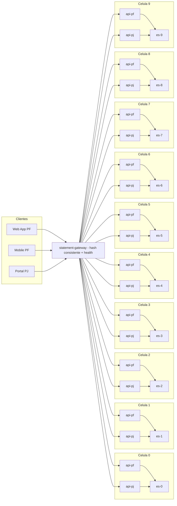

# Extrato - "Bulkheads Celulares"

## Contexto
Mesmo após sharding de busca e canary, picos de **PF** (payloads menores e muito mais requisições) impactam **PJ** (payload maior e consultas agregadas), pois **capacidade de app é compartilhada**. Resultado: degradação cruzada de p95/p99 e incidentes durante horários de pico.

**Baseline (14 dias; dados fictícios):**
- p95 `/pf/statement?page=1`: 480 ms (pico sobe a 820 ms)
- p95 `/pj/statement/search`: 780 ms (pico sobe a 1.6 s)
- Incidentes por pico: 6–8/semana (majoritariamente saturação de pods PJ)
- ES já shardeado em 10 clusters; porém **replicas do app** ainda **não segregadas por público**

## Objetivo (SMART)
Até **2025-10-31**:
- **Isolamento**: p95 de PF **não varia > +10%** quando PJ está em pico e vice-versa
- **Latência alvo**: PF p95 ≤ **500 ms**, PJ p95 ≤ **850 ms** em pico
- **Incidentes** por pico ≤ **2/semana**
- **Blast radius** ≤ **1 célula** (10% da base) em falha de célula
- **Disponibilidade** statement-api por público ≥ **99,7%**
Medição em janelas simétricas de 14 dias (pré/pós), fontes: Prometheus/APM.

## Decisão
Adotar **arquitetura celular** com **10 células** independentes (C1..C10). Cada célula contém:
- **statement-api PF** (perfil/Service/Quota/HPA próprios)
- **statement-api PJ** (perfil/Service/Quota/HPA próprios)
- **ingestion PF** e **ingestion PJ**
- **Elasticsearch** da célula (índices `statements-{tenant}-{yyyyMM}`)

Criar o **statement-gateway** (stateless) como **roteador central agnóstico**:
- Roteia por **afinidade PF/PJ** + **hash consistente** de `accountId` para **1 de 10 células**
- **Health-aware**: *failover* temporário para célula vizinha em caso de “unhealthy”
- Mantém **stickiness** por `accountId` para estabilidade de cache

A afinidade garante **capacidade segregada por público dentro de cada célula** e elimina *noisy neighbors* PF↔PJ.

## Alternativas Consideradas
- **Dois “superclusters” (PF e PJ)**: reduz interferência, mas mantém blast radius alto e hotspots por volume; rejeitado.
- **QoS/priority no mesmo pool**: melhora preempção, mas não resolve contenção de recursos de runtime e caches; rejeitado.
- **Escalar apenas PJ agressivamente**: encarece e não evita competição durante rajadas; rejeitado.

## Consequências
**Positivas**: isolamento PF/PJ; latência previsível; blast radius limitado; janelas de manutenção por célula; *capacity planning* por perfil.  
**Negativas**: mais objetos e *overhead* operacional (10× células); risco de **fragmentação** de capacidade; necessidade de **rebalance**.

## Plano de Implementação
1) **Gateway**: `statement-gateway` com libraria de **hash consistente** (rendezvous) usando `(segmento, accountId)` → célula. Health-checks por célula; circuit breaker e *timeouts* curtos.  
2) **K8s por célula**: Namespaces `cell-0..9`; 4 Deployments por célula (`api-pf`, `api-pj`, `ing-pf`, `ing-pj`); **ResourceQuota** e **HPA** por perfil.  
3) **Busca por célula**: ES `es-0..9`; índices por tenant/mês; *routing* por `accountId`.  
4) **Ingestão segregada**: tópicos Kafka por célula e segmento (`txn-pf-0..9`, `txn-pj-0..9`); consumidores respectivos.  
5) **Cutover**: 10% contas → 30% → 60% → 100% (por buckets de hash); **dual-read** opcional na transição.  
6) **Rebalance**: ferramenta para mover *buckets* entre células (mínima redistribuição).

## Métricas & Observabilidade
- **PF**: p95/p99, 5xx, throughput por célula; **PJ** idem
- **Gateway**: roteamentos por célula, quedas/timeout, *fallback rate*
- **Célula**: CPU/mem, filas, ES health, cache hit
- **Isolamento**: variação de p95 do outro público durante picos controlados (testes sintéticos)

## Resultados Esperados — STAR
**S**: picos PF afetando PJ, 6–8 incidentes/semana, p95 PJ até 1.6 s.  
**T**: isolar públicos, PF p95 ≤ 500 ms, PJ p95 ≤ 850 ms, ≤ 2 incidentes/semana, blast radius ≤ 1 célula.  
**A**: 10 células; gateway com hash consistente por segmento; quotas/HPA por perfil; ingestão segregada; ES por célula.  
**R**: queda de incidentes; picos PF não degradam PJ e vice-versa; latências dentro das metas (validar T+14/T+30).