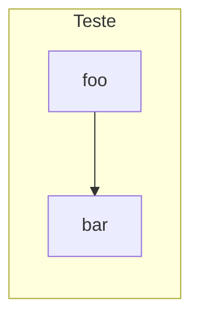

# Exemplo de Título

## Contexto 
Descreva o cenário atual e por que a mudança é necessária **neste momento**.
- Público/segmentos envolvidos: `<segmentos>` (ex.: PF, PJ, regiões, tenants, planos).
- Sintomas: picos de latência, erros, competição de recursos entre segmentos, *blast radius* amplo.
- Topologia atual: `<monólito/cluster único/sharding parcial>`.

- **Baseline (janela e fonte)**:  
  - p95 `<rota principal>` = `<valor>` em `<janela>`; p99 = `<valor>` (fonte: `<Prometheus/APM>`).  
  - Incidentes relacionados = `<#>/semana`.  
  - Disponibilidade = `<%>` (SLO = `<%>`).  
  - Custo mensal aproximado = `<USD/BRL>`.

Restrições e premissas: `<sem breaking change | budget | compliance | contratos de SLA>`.

---

## Objetivo — SMART (Task)
Especifique metas **específicas, mensuráveis, viáveis, relevantes, com prazo**.
- Até `<data-alvo>`:  
  - **Isolamento**: variação de p95 de um segmento quando outro está em pico ≤ `<+X%>`.  
  - **Latência alvo**: p95 `<rota>` ≤ `<valor>`; p99 ≤ `<valor>` em pico.  
  - **Confiabilidade**: incidentes por pico ≤ `<N>/semana`; disponibilidade ≥ `<SLO%>`.  
  - **Blast radius**: falhas confinadas a **≤ 1 célula** (≈ `<100/Ncells>%` da base).  
  - **Custo**: dentro de `<±Y%>` do baseline.  
  - **Medição**: janelas simétricas de `<14>` dias (pré/pós); fontes: `<Prometheus/APM/ES>`.

---

## Decisão

Descreva a decisão a ser seguida, seguida de algum flowchart de exemplo

---

## Alternativas Consideradas
1. ...

---

## Consequências
**Positivas**
- descreva uma lista de consequencias positivas

**Negativas**
- descreva os tradeoffs

---

---

## Plano de Implementação e Rollout
1. Step 1
2. Step 2
---

## Métricas de Sucesso e Observabilidade
As métricas a serem consideradas

- **Por segmento**: `p95`, `p99`, taxa de `5xx`, throughput, erro sintético.  
- **Por célula**: CPU/mem, fila, *cache hit*, *storage/search health*.  
- **Gateway**: *routing count*, *fallback rate*, timeouts, latência.  
- **Isolamento**: variação de p95 do segmento B quando segmento A está em pico controlado.  
- **Custo**: por célula/segmento; *cost per successful request*.

**Alertas mínimos**
- `p95{segment,cell} > alvo` por 5 min.  
- `fallback_rate > X%`.  
- *Health* de célula vermelha > 2 min.  
- *Consumer lag* ingestão por célula > `<limite>`.

---

## Resultados — STAR

**S (Situation)**  
- Antes da mudança: p95 `<valor>`, p99 `<valor>`, incidentes `<N>/semana`, *blast radius* global, custo `<valor>`.  
- Fontes/Janela: `<Prometheus/APM>`, `<datas>`.

**T (Task)**  
- Metas SMART: (isolar picos, p95 alvo, incidentes, SLO, custo) até `<data>`.

**A (Action)**  
- Ações realizadas: nº de células, afinidades configuradas, quotas/HPAs por perfil, ingestão segregada, gateway com hash consistente, cutover por buckets, *failover/failback*, rebalance.

**R (Result)**  
- Após `<14>` dias de 100%:  
  - p95 `<rota>` = `<valor>` (Δ `<abs>` / `<rel%>`), p99 `<valor>`.  
  - Incidentes `<N>/semana`; disponibilidade `<%>`.  
  - *Blast radius* limitado a **1 célula** nos testes/falhas reais.  
  - Custo `<Δ%>` vs baseline.  
  - Observações: efeitos colaterais, *debt* assumido, **T+30** agendado.

